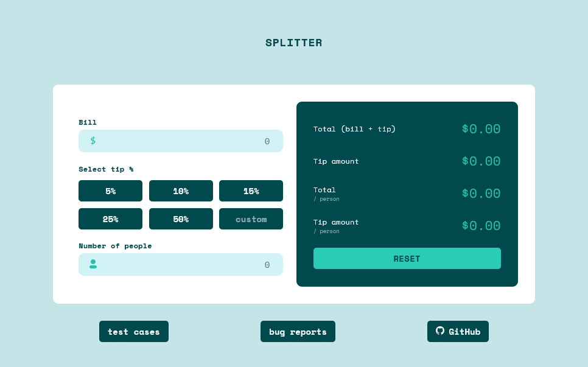

# Splitter - Tip Calculator App



## Project Overview

**Splitter** is a tip calculator application built as a core project for my testing portfolio. The goal of this project was to go beyond just building a functional web application. My primary objective was to demonstrate a comprehensive and professional approach to quality assurance and software testing. This project showcases the entire testing lifecycle, from planning and test case creation to bug reporting and test automation.

## Key Features

- **Tip Calculation:** The user can enter a bill amount and either select from pre-defined tip percentages (5%, 10%, 15%, 25%, 50%) or input a custom value.
- **Bill Splitting:** The app calculates the total tip and the amount each person should pay, based on the number of people.
- **Input Validation:** The application includes validation to handle invalid inputs such as negative numbers, zero, or non-numeric characters.
- **Interactive UI:** Buttons and input fields provide clear visual feedback to the user.
- **Responsiveness:** The user interface is designed to adapt to different screen sizes and resolutions.

## Built with

- HTML
- CSS
- JavaScript
- Cypress
- AI support :)

## How to run

The application is deployed in netlify service so you can open it by going to address:  
https://splitter-kwlodarczyk.netlify.app/

Alternative way is installing this repo and run index.html.

## Tests

The project has a strong focus on quality assurance. Each functionality is covered with test cases and automated tests (Cypress).

### 1. Test Documentation

I created a **comprehensive set of test cases** to verify every aspect of the application's functionality. The documentation includes both positive ("Happy Path") and negative scenarios, which test error handling and edge cases. The tests are organized by functional area, which is a standard practice for maintaining clarity and scalability in professional environments.

- **Location:** `/tests/test-cases.html`
- **Process:** The test cases are stored in a structured JSON file (`/tests/test-cases.json`). This approach makes it easy to add or modify tests without directly editing HTML. A JavaScript script (`/scripts/generate-tests.js`) dynamically renders the test cases, demonstrating an understanding of automation and maintainability.

### 2. Bug Reporting

I identified and documented several bugs discovered during my manual testing. Each bug report follows my flow of bug reporting.

- **Location:** `/tests/bug-reports.html`

### 3. Test Automation

I have automated a significant number of test cases to serve as a regression suite. These tests cover critical functionalities and ensure that new changes do not introduce bugs, demonstrating my understanding of hybrid testing methodologies and test scalability.

- **Location:** `/tests/spec.cy.js`

- **How to run automated tests**

From the root of the project open cmd and write the prompt:

```bash
npm install
npx cypress run
```
